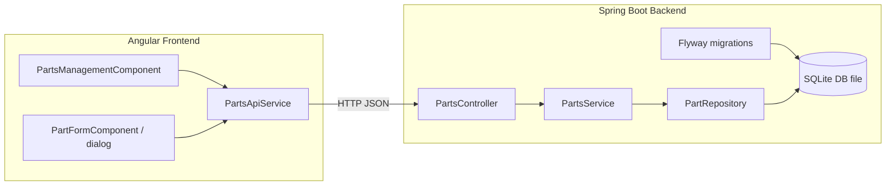

# Feature 7 — Architecture Design: Parts Inventory Management (CRUD)

> NOTE (Design Review): The repo’s Design Review Agent is expected to maintain architecture docs under `pipeline/architecture-design/`.
> This file remains as the original handoff artifact referenced by the Feature 7 spec.
> The reviewed/updated architecture is maintained in `pipeline/architecture-design/feature-7-architecture.md`.

## 1) Scope and dependencies

### In scope (per spec)
- CRUD for parts catalog/inventory:
  - add part
  - edit part
  - delete part (soft delete preferred)
  - list/search parts

### Out of scope (per spec)
- Reservations flows, replenishment/purchasing, warehouse/bin locations, serial tracking, bulk import/export.
- RBAC beyond a simple admin guard.

### Depends on
- Feature 5 (SQLite persistence foundation): local-only SQLite, versioned migrations, explicit seed modes, stable API/error semantics.

### Compatibility constraints
- Must preserve existing `ApiError` response shape and 400/404/409 semantics.
- Must not break existing parts reservation flows that already rely on parts inventory.

---

## 2) High-level architecture

### Backend (Spring Boot)
Layered architecture (repo conventions):
- `controller` — REST endpoints under `/api/parts`
- `service` — business rules (uniqueness, soft delete, optional delete guard)
- `data` — repository + persistence mapping
- `dto` — request/response DTOs
- `model` — domain model (if distinct from persistence entity)

Persistence:
- SQLite file DB (local-only) with versioned migrations.
- Parts are stored in a `parts` table keyed by `sku`.

### Frontend (Angular)
- One screen: Parts Management.
- All HTTP calls via a dedicated Angular service (no `HttpClient` in components).
- Minimal UI: list/search, add, edit, delete with confirmation.

---

## 3) Component diagram

---

## 4) Data model and persistence design

### Logical model (from spec)
`Part`:
- `sku` (string, unique, required)
- `name` (string, required)
- `description` (string, optional)
- `quantityOnHand` (integer, required, $\ge 0$)
- `active` (boolean, required; `false` means soft-deleted/retired)

### Physical schema (SQLite)

#### Table: `parts`
- `sku` TEXT PRIMARY KEY
- `name` TEXT NOT NULL
- `description` TEXT NULL
- `quantity_on_hand` INTEGER NOT NULL CHECK(quantity_on_hand >= 0)
- `active` INTEGER NOT NULL CHECK(active IN (0,1))
- `created_at` TEXT NOT NULL (ISO-8601) (optional but recommended)
- `updated_at` TEXT NOT NULL (ISO-8601) (optional but recommended)

Indexes:
- `idx_parts_active` on (`active`)
- `idx_parts_name` on (`name`) (optional; helps search)

Notes:
- `sku` uniqueness is enforced by PK.
- Soft delete is implemented by setting `active=0`.

### Migrations
- Add a new Flyway migration for the `parts` table if it does not already exist from Feature 5.
- If Feature 5 already created `parts`, Feature 7 must be additive only (e.g., add missing columns/indexes) and must not change existing API shapes.

Recommended migration files (names illustrative; actual numbering must follow existing Flyway sequence):
- `Vx__create_parts_table.sql` (if missing)
- `Vx__add_parts_indexes.sql` (optional)

### Seed strategy
Aligned to Feature 5 decisions:
- `seed=none`: no parts inserted.
- `seed=baseline`: insert a small deterministic set of parts (including examples used by existing reservation demos/tests).
- `seed=reset`: delete/replace DB file then apply migrations and seed baseline (local demo only).

---

## 5) Backend API design

Base path: `/api/parts`

### 5.1 List/search parts
`GET /api/parts?q={q?}&activeOnly={activeOnly?}`

Behavior:
- `activeOnly` defaults to `true`.
- `q` performs a contains match against SKU or name.

Response:
- `200 OK` with `PartDto[]`.

Implementation notes:
- Repository query should be parameterized.
- For SQLite, implement search as:
  - `WHERE (sku LIKE '%' || :q || '%' OR name LIKE '%' || :q || '%')`
  - plus `AND active = 1` when `activeOnly=true`.

### 5.2 Get part by SKU
`GET /api/parts/{sku}`

Response:
- `200 OK` with `PartDto`
- `404 Not Found` with `ApiError` if not found (including soft-deleted when `activeOnly` semantics are desired; spec says “SKU does not exist”, so treat inactive as not found for this endpoint unless the UI needs otherwise).

### 5.3 Create part
`POST /api/parts`

Request: `PartCreateRequest`

Response:
- `201 Created` with `PartDto`
- `400 Bad Request` with `ApiError` for validation
- `409 Conflict` with `ApiError` if SKU already exists (including inactive; spec says SKU must be unique)

### 5.4 Update part
`PUT /api/parts/{sku}`

Request: `PartUpdateRequest` (full replace for MVP)

Response:
- `200 OK` with `PartDto`
- `400 Bad Request` with `ApiError` for validation
- `404 Not Found` with `ApiError` if SKU does not exist

Rule:
- Path `sku` is authoritative.
- If request body contains `sku`, it must match path or be rejected with 400.

### 5.5 Delete part (soft delete)
`DELETE /api/parts/{sku}`

Behavior:
- Soft delete: set `active=false`.

Response:
- `204 No Content` on success
- `404 Not Found` with `ApiError` if SKU does not exist
- `409 Conflict` with `ApiError` if delete is blocked due to existing ACTIVE reservations referencing the SKU (optional guard per spec)

Delete guard recommendation:
- If the reservations table exists (Feature 5 scope), check for active reservations by SKU.
- If present, return 409 with a message like: "Part cannot be deleted while active reservations exist. Cancel reservations first.".

---

## 6) DTOs and validation

### Response DTO
`PartDto`
- `sku: string`
- `name: string`
- `description?: string | null`
- `quantityOnHand: number`
- `active: boolean`

### Requests

`PartCreateRequest`
- `sku: string`
- `name: string`
- `description?: string | null`
- `quantityOnHand: number`
- `active: boolean` (required by spec; defaulting to `true` is acceptable only if spec allows omission—spec shows it present, so keep required)

`PartUpdateRequest`
- `name: string`
- `description?: string | null`
- `quantityOnHand: number`
- `active: boolean`
- optional `sku?: string` (only if you want to support “must match path” rule; otherwise omit from DTO)

### Bean Validation rules (backend)
Apply Jakarta validation annotations on request DTOs:
- `sku`
  - `@NotBlank`
  - `@Pattern(regexp = "^[A-Z0-9-]{3,32}$")`
- `name`
  - `@NotBlank`
  - `@Size(max = 120)`
- `description`
  - `@Size(max = 500)`
- `quantityOnHand`
  - `@NotNull`
  - `@Min(0)`
- `active`
  - `@NotNull`

Validation error handling:
- Must map to `400` with `ApiError` per repo conventions.

Conflict handling:
- Duplicate SKU on create must map to `409` with `ApiError`.

Not-found handling:
- Unknown SKU on get/update/delete must map to `404` with `ApiError`.

---

## 7) Backend implementation recommendations (aligned to conventions)

### Packages (expected)
- `...controller.PartsController`
- `...service.PartsService`
- `...data.PartRepository`
- `...dto.PartDto`, `PartCreateRequest`, `PartUpdateRequest`
- `...data.PartEntity` (if using JPA) or `...data.PartRow` (if using JDBC)

### Repository technology
Use the same persistence approach chosen in Feature 5 (do not introduce a new one in Feature 7). If Feature 5 selected:
- Spring Data JDBC: implement `CrudRepository<PartRow, String>` and custom query methods for search.
- Spring Data JPA: implement `JpaRepository<PartEntity, String>` and custom query methods.

### Transaction boundaries
- Create/update/delete should be transactional.
- Delete guard check + soft delete update should be in the same transaction to avoid race conditions.

### Error mapping
- Prefer explicit service-layer checks and throw domain exceptions mapped by a global exception handler to `ApiError`.
- For duplicate SKU, either:
  - pre-check `existsById(sku)` then 409, or
  - rely on DB constraint and translate constraint violation to 409.

---

## 8) Frontend design (Angular)

### Route
- `/parts/manage` (or nearest existing routing convention).

### Components
- `PartsManagementComponent`
  - Search input (`q`)
  - Active-only toggle
  - Table/list of parts
  - Actions: Add, Edit, Delete

- `PartFormComponent` (modal/dialog or inline)
  - Create mode includes `sku`
  - Edit mode disables `sku` (path is authoritative)
  - Shows backend validation errors

### Angular service
`PartsApiService` (name per spec suggestion is acceptable)
- `listParts(q?: string, activeOnly: boolean = true): Observable<Part[]>`
- `getPart(sku: string): Observable<Part>`
- `createPart(req: PartCreateRequest): Observable<Part>`
- `updatePart(sku: string, req: PartUpdateRequest): Observable<Part>`
- `deletePart(sku: string): Observable<void>`

### Error UX
- 400: show field-level validation messages when possible.
- 409: show conflict banner/toast (duplicate SKU, delete blocked).
- 404: show not-found message (e.g., stale edit).

### Test hooks
Add stable `data-testid` attributes (per spec) for:
- search input
- active-only toggle
- add button
- save button
- delete button
- confirm delete button
- parts table rows (include SKU)

---

## 9) Data flow design

### List/search
1. User types search / toggles active-only.
2. `PartsManagementComponent` calls `PartsApiService.listParts(q, activeOnly)`.
3. Backend `PartsController` delegates to `PartsService`.
4. `PartsService` queries repository and maps rows/entities to `PartDto`.
5. UI renders list.

### Create
1. User submits create form.
2. UI calls `createPart`.
3. Backend validates request; on success inserts row.
4. Returns `201` with created `PartDto`.
5. UI refreshes list.

### Update
1. User edits fields and saves.
2. UI calls `updatePart(sku, req)`.
3. Backend validates; checks existence; updates row.
4. Returns `200` with updated `PartDto`.

### Delete (soft)
1. User confirms delete.
2. UI calls `deletePart(sku)`.
3. Backend checks existence; optional guard; sets `active=false`.
4. Returns `204`.

---

## 10) Test strategy (aligned to Definition of Done)

### Backend tests
Use Spring Boot test style already present in repo.

Minimum coverage (per spec DoD):
- Create success → `201` and body matches.
- Create duplicate SKU → `409` with `ApiError`.
- Update missing SKU → `404` with `ApiError`.
- Delete existing SKU → `204` and subsequent get returns `404` (or list excludes when `activeOnly=true`).
- List/search:
  - `GET /api/parts` returns active parts by default.
  - `q` filters by SKU/name contains.

Additional recommended tests (still within spec intent):
- Validation: invalid SKU pattern → `400`.
- Quantity negative → `400`.
- Delete guard (if implemented): active reservation exists → `409`.

DB setup for tests:
- Use an ephemeral SQLite DB file per test run (temp directory) or an in-memory SQLite connection if supported by the chosen stack.
- Apply Flyway migrations on startup.
- Seed baseline deterministically when needed.

### Frontend tests
Minimum coverage (per spec DoD):
- Component renders list (mock service returns parts).
- Create flow calls service with expected payload.
- Delete confirmation triggers service call.

Recommended:
- Verify `data-testid` selectors exist for key controls.

---

## 11) Risks and mitigations

- **Risk: breaking existing reservation flows** if parts table/DTO differs.
  - Mitigation: keep `PartDto` fields consistent with existing parts endpoints; add migrations additively.

- **Risk: duplicate SKU behavior with soft-deleted parts**.
  - Mitigation: treat any existing SKU (active or inactive) as conflict on create (spec: SKU unique).

- **Risk: search performance**.
  - Mitigation: keep dataset small (training app); optional indexes on `active` and `name`.

- **Risk: delete guard requires reservation schema knowledge**.
  - Mitigation: implement guard only if reservation table exists and “ACTIVE” status is well-defined; otherwise omit guard and rely on soft delete to preserve history.
